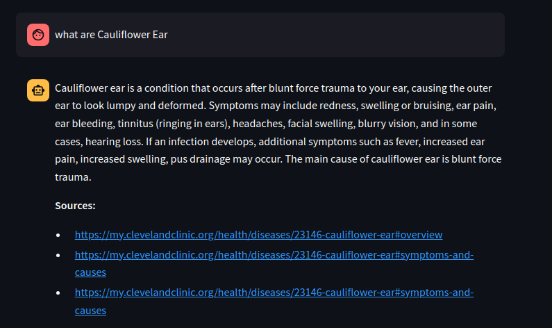

## Prerequisites

- Anaconda or Miniconda installed
- Git installed

## Getting Started

Follow these steps to set up and run your project.

### Installation

1. Create a new virtual environment using conda:

   ```bash
   conda create -n chatbot python

2. Activate the virtual environment:

   ```bash
   conda activate chatbot
  
3. Clone the repository

   ```bash
   git clone https://github.com/shulavkarki/Healthcare-Chatbot.git

4. Navigate to the project repository:

   ```bash
   cd Healthcare-Chatbot


5. Install the required packages, libraries and frameworks:

    ```bash
    pip install -r requirements.txt

6. Start the application:

   ```bash
   ./run_app.sh


### Samples
#markdown for  image in sample_app folder


